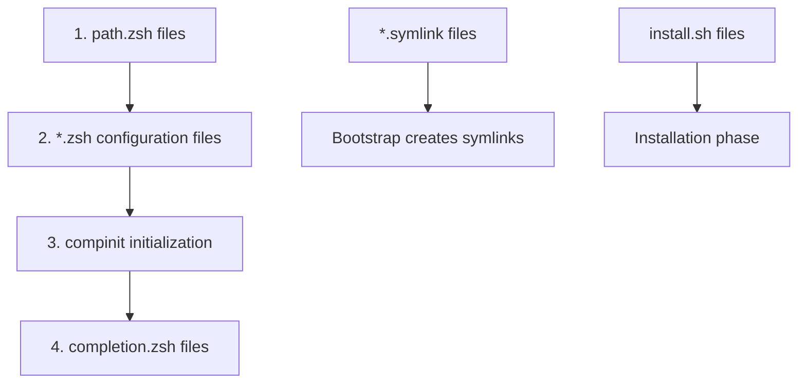

# 🧬 Microdots Architecture Guide

**A Complete Guide to Microservices Architecture for Configuration Management**

---

## Table of Contents

1. [What is a Microdot?](#what-is-a-microdot)
2. [Core Philosophy](#core-philosophy)
3. [Architecture Principles](#architecture-principles)
4. [Microdot Anatomy](#microdot-anatomy)
5. [Lifecycle & Discovery](#lifecycle--discovery)
6. [Special Files & Purpose](#special-files--purpose)
7. [Loading Order & Integration](#loading-order--integration)
8. [Best Practices](#best-practices)
9. [Implementation Examples](#implementation-examples)
10. [AI Prompt for Microdot Creation](#ai-prompt-for-microdot-creation)

---

## What is a Microdot?

A **microdot** is a self-contained configuration microservice that manages a specific aspect of your development environment. Think of it as applying **distributed systems architecture** to dotfiles management.

### Traditional vs Microdots Approach

**Traditional Dotfiles (Monolithic):**
```bash
# Single massive .zshrc file
# One .vimrc with everything
# Brittle, hard to maintain, all-or-nothing
```

**Microdots (Microservices):**
```bash
git/          # Git microservice
docker/       # Docker microservice  
node/         # Node.js microservice
backup/       # Backup microservice
```

Each microdot is an **independent service** that:
- **Self-discovers** through filesystem conventions
- **Self-contains** all functionality for its domain
- **Self-defends** against missing dependencies
- **Self-heals** through automated installation

---

## Core Philosophy

### The Four Foundational Principles

#### 1. **Zero Coupling**
- Removing any microdot never breaks another
- Each microdot works independently
- No shared state or dependencies between microdots

#### 2. **Convention Over Configuration**
- Filesystem naming patterns enable automatic discovery
- No manifests, registries, or hardcoded lists required
- Drop a directory with the right structure → it just works

#### 3. **Defensive Programming**
- Always check before configuring
- Gracefully handle missing dependencies
- Fail safely without breaking the system

#### 4. **Progressive Enhancement**
- Add functionality without breaking existing setup
- Each microdot adds value incrementally
- System remains functional even with partial failures

### Distributed Systems Parallels

| Microservices Concept | Microdot Implementation |
|----------------------|-------------------------|
| Service Discovery | Filesystem scanning for standard files |
| Auto Scaling | Dynamic loading based on available tools |
| Circuit Breaker | Defensive checks before configuration |
| Hot Deployment | Add/remove microdots without restart |
| Health Checks | Validation of dependencies and state |

---

## Architecture Principles

### Service Autonomy
Each microdot manages its complete lifecycle:
- **Installation**: Dependencies and setup
- **Configuration**: Runtime behavior
- **Integration**: Shell aliases, functions, PATH
- **Maintenance**: Updates and health checks

### Automatic Service Discovery
The system uses **filesystem conventions** as the service registry:

```bash
# Discovery happens automatically
for microdot in ~/.dotfiles/*/; do
  [[ -f "$microdot/path.zsh" ]] && source "$microdot/path.zsh"
  [[ -f "$microdot/install.sh" ]] && installers+=("$microdot/install.sh")
done
```

### Fault Isolation
Failures are contained within individual microdots:
- One broken microdot doesn't affect others
- System continues functioning with degraded capability
- Easy to debug and fix isolated issues

---

## Microdot Anatomy

### Complete Directory Structure

```
topic-name/                    # Microdot root (the service boundary)
├── path.zsh                  # Environment setup (loaded 1st)
├── config.zsh                # Main configuration (loaded 2nd)
├── aliases.zsh               # Command shortcuts (loaded 2nd)
├── functions.zsh             # Helper functions (loaded 2nd)
├── completion.zsh            # Tab completions (loaded 4th)
├── *.symlink                 # Files to link to $HOME
├── install.sh                # Installation & dependency management
├── README.md                 # Documentation
└── lib/                      # Internal libraries (optional)
    └── helpers.zsh           # Shared functions within microdot
```

### Self-Containment Rules

1. **Everything needed lives in the microdot directory**
2. **No references to other microdots** (zero coupling)
3. **All dependencies are checked before use**
4. **Graceful degradation when tools are missing**

---

## Lifecycle & Discovery

### 1. Bootstrap Phase
```bash
# System discovers all microdots
find ~/.dotfiles -name "*.symlink" -exec ln -sf {} ~/.{} \;
find ~/.dotfiles -name "install.sh" -exec chmod +x {} \;
```

### 2. Installation Phase
```bash
# Each microdot installs its dependencies
for installer in ~/.dotfiles/*/install.sh; do
  "$installer" || echo "Warning: $(dirname $installer) installation failed"
done
```

### 3. Runtime Integration
```bash
# Shell integration follows strict loading order
# 1. PATH setup
for path_file in ~/.dotfiles/*/path.zsh; do
  source "$path_file"
done

# 2. Configuration loading
for config_file in ~/.dotfiles/**/*.zsh; do
  [[ "$(basename "$config_file")" != "completion.zsh" ]] && source "$config_file"
done

# 3. Completion initialization
autoload -U compinit && compinit

# 4. Completion loading
for completion_file in ~/.dotfiles/*/completion.zsh; do
  source "$completion_file"
done
```

### 4. Hot Deployment
- **Add microdot**: Drop directory → immediate availability
- **Remove microdot**: Delete directory → clean removal
- **Update microdot**: Replace files → seamless updates

---

## Special Files & Purpose

### `path.zsh` - Environment Foundation
**Purpose**: Establish environment before any configuration
**When**: Loaded first, before all other files
**Pattern**: Defensive PATH and environment variable setup

```bash
#!/usr/bin/env zsh
# Ensure tool is available before configuration

# Defensive: Check multiple installation locations
if [[ -x "/opt/homebrew/bin/mytool" ]]; then
  export PATH="/opt/homebrew/bin:$PATH"
elif [[ -x "/usr/local/bin/mytool" ]]; then
  export PATH="/usr/local/bin:$PATH"
fi

# Export configuration variables
export MYTOOL_HOME="$HOME/.mytool"
export MYTOOL_CONFIG="$HOME/.config/mytool"
```

### `*.zsh` - Runtime Configuration  
**Purpose**: Configure tools, add aliases and functions
**When**: Loaded second, after PATH setup
**Pattern**: Defensive configuration with existence checks

```bash
#!/usr/bin/env zsh
# Configure tool only if available

if command -v mytool >/dev/null 2>&1; then
  # Safe initialization
  eval "$(mytool init zsh 2>/dev/null)" || {
    echo "Warning: mytool init failed" >&2
  }
  
  # Aliases and functions
  alias mt='mytool'
  alias mts='mytool status'
  
  mytool_quick() {
    mytool --quick "$@"
  }
fi
```

### `completion.zsh` - Tab Completion
**Purpose**: Provide intelligent tab completion
**When**: Loaded last, after compinit
**Pattern**: Conditional completion loading

```bash
#!/usr/bin/env zsh
# Add completions only if tool exists

if command -v mytool >/dev/null 2>&1; then
  # Source static completions
  [[ -f "/usr/share/zsh/completions/_mytool" ]] && \
    source "/usr/share/zsh/completions/_mytool"
    
  # Or generate dynamic completions
  eval "$(mytool completions zsh 2>/dev/null)"
fi
```

### `*.symlink` - Configuration Files
**Purpose**: Link configuration files to their proper locations
**When**: Created during bootstrap
**Pattern**: Configuration files with `.symlink` extension

```bash
# Examples:
gitconfig.symlink              # → ~/.gitconfig
vimrc.symlink                  # → ~/.vimrc
config/
  tool.symlink                 # → ~/.config/tool
ssh/
  config.symlink               # → ~/.ssh/config
```

### `install.sh` - Dependency Management
**Purpose**: Install and configure the microdot's dependencies
**When**: Run during system installation/updates
**Pattern**: Idempotent, defensive, informative

```bash
#!/usr/bin/env bash
set -e

# Source UI library for consistent output
source "$DOTFILES_ROOT/core/lib/ui.sh" 2>/dev/null || {
  info() { echo "$@"; }
  success() { echo "✓ $@"; }
  error() { echo "✗ $@" >&2; }
}

info "Installing mytool..."

# Idempotent check
if command -v mytool >/dev/null 2>&1; then
  success "mytool already installed"
  exit 0
fi

# Try multiple installation methods
if command -v brew >/dev/null 2>&1; then
  brew install mytool && success "Installed via Homebrew"
elif command -v apt-get >/dev/null 2>&1; then
  sudo apt-get install -y mytool && success "Installed via apt"
else
  error "Could not install mytool - no supported package manager"
  exit 1
fi

# Post-installation setup
if [[ ! -d "$HOME/.mytool" ]]; then
  mkdir -p "$HOME/.mytool"
  mytool init > "$HOME/.mytool/config"
  success "mytool configuration initialized"
fi
```

---

## Loading Order & Integration

### Strict Loading Sequence

The loading order is **critical** for proper functionality:



### Integration Points

1. **Environment Setup** (`path.zsh`)
   - PATH modifications
   - Environment variables
   - Tool availability preparation

2. **Configuration Loading** (`*.zsh`)
   - Tool initialization
   - Alias definitions
   - Function declarations
   - Custom configurations

3. **Completion Setup** (`completion.zsh`)
   - Tab completion registration
   - Completion function loading
   - Command completion enhancement

4. **File Management** (`*.symlink`)
   - Configuration file placement
   - Dotfile organization
   - Home directory integration

### UI Library Integration

All microdots should use the unified UI library for consistent output:

```bash
# Source the UI library
source "$DOTFILES_ROOT/core/lib/ui.sh"

# Use standard functions
header "🔧 Installing Tool"
info "Checking dependencies..."
success "Tool installed successfully"
warning "Optional feature not available"
error "Installation failed"
```

---

## Best Practices

### ✅ Essential Patterns

#### 1. Defensive Programming
```bash
# ALWAYS check before configuring
if command -v tool >/dev/null 2>&1; then
  eval "$(tool init)"
fi

# NEVER assume tools exist
# eval "$(tool init)"  # BAD - will error if missing
```

#### 2. Idempotent Operations
```bash
# Can run multiple times safely
if [[ ! -f "$HOME/.tool/config" ]]; then
  cp template.config "$HOME/.tool/config"
fi

# NOT this
# cp template.config "$HOME/.tool/config"  # Fails on second run
```

#### 3. Graceful Error Handling
```bash
# Handle failures gracefully
tool init 2>/dev/null || {
  warning "tool initialization failed, using defaults"
}

# Don't fail silently
# tool init 2>/dev/null || true  # BAD
```

#### 4. Self-Contained Design
```bash
# GOOD: Everything in microdot directory
source "${0:A:h}/lib/helpers.zsh"

# BAD: Dependencies on other microdots
source "$DOTFILES_ROOT/other-tool/lib.zsh"  # Creates coupling!
```

### ❌ Anti-Patterns to Avoid

#### 1. Hardcoded Paths
```bash
# BAD: User-specific paths
source /Users/myname/.dotfiles/tool/config.zsh

# GOOD: Dynamic paths
source "${0:A:h}/config.zsh"
```

#### 2. Cross-Microdot Dependencies
```bash
# BAD: Coupling between microdots
if [[ -f "$DOTFILES_ROOT/git/functions.zsh" ]]; then
  source "$DOTFILES_ROOT/git/functions.zsh"
  git_helper_function
fi

# GOOD: Self-contained functionality
local_git_helper() {
  # Implement needed functionality locally
}
```

#### 3. Global Namespace Pollution
```bash
# BAD: Generic names
temp_var="something"
config() { ... }

# GOOD: Prefixed names
_tool_temp_var="something"
tool_config() { ... }
```

---

## Implementation Examples

### Example 1: Simple Tool Microdot

```bash
docker/
├── aliases.zsh          # Docker shortcuts
├── functions.zsh        # Docker helper functions
└── install.sh          # Install Docker
```

**aliases.zsh:**
```bash
#!/usr/bin/env zsh
if command -v docker >/dev/null 2>&1; then
  alias dk='docker'
  alias dkp='docker ps'
  alias dkpa='docker ps -a'
  alias dki='docker images'
  alias dkclean='docker system prune -af'
fi
```

### Example 2: Complex Tool with Environment

```bash
python/
├── path.zsh             # Python environment setup
├── config.zsh           # Pyenv and tool configuration
├── aliases.zsh          # Python shortcuts
├── functions.zsh        # Python helpers
├── completion.zsh       # Python completions
└── install.sh          # Install Python tools
```

**path.zsh:**
```bash
#!/usr/bin/env zsh
# Set up Python environment
if [[ -d "$HOME/.pyenv" ]]; then
  export PYENV_ROOT="$HOME/.pyenv"
  export PATH="$PYENV_ROOT/bin:$PATH"
fi

if [[ -d "$HOME/.poetry" ]]; then
  export POETRY_HOME="$HOME/.poetry"
  export PATH="$POETRY_HOME/bin:$PATH"
fi
```

### Example 3: Microdot with Configuration Files

```bash
git/
├── gitconfig.symlink    # → ~/.gitconfig
├── gitignore.symlink    # → ~/.gitignore
├── aliases.zsh          # Git aliases
├── functions.zsh        # Git helper functions
└── install.sh          # Install git extras
```

### Example 4: Self-Contained Service (Backup Example)

```bash
backup/
├── backup               # Main executable (self-contained)
├── backup.json          # Configuration
├── backup.zsh           # Shell integration
├── path.zsh             # PATH setup
├── install.sh          # Dependency installation
└── README.md           # Documentation
```

This backup microdot is **completely self-contained**:
- All functionality in the `backup` executable
- JSON configuration for settings
- Shell integration for aliases
- No dependencies on other microdots
- Can be added/removed without affecting anything else

---

## AI Prompt for Microdot Creation

### Master Prompt for Converting Any Project to a Microdot

```markdown
# MICRODOT CONVERSION PROMPT

You are an expert systems architect specializing in converting projects into microdots - self-contained configuration microservices that follow distributed systems principles.

## CONTEXT: What is a Microdot?

A microdot is a **self-contained configuration microservice** that manages one specific tool or domain. It follows these core principles:

### CRITICAL PRINCIPLES (NEVER VIOLATE):
1. **ZERO COUPLING** - Must work independently, no dependencies on other microdots
2. **SELF-CONTAINMENT** - Everything needed lives in the microdot directory
3. **DEFENSIVE PROGRAMMING** - Always check dependencies before configuring
4. **CONVENTION OVER CONFIGURATION** - Use filesystem patterns for auto-discovery

## REQUIRED DIRECTORY STRUCTURE:

```
{project-name}/               # Root directory (the service boundary)
├── path.zsh                 # Environment/PATH setup (loaded FIRST)
├── {name}.zsh               # Main configuration (loaded SECOND)
├── aliases.zsh              # Command aliases (loaded SECOND) 
├── functions.zsh            # Helper functions (loaded SECOND)
├── completion.zsh           # Tab completions (loaded LAST)
├── *.symlink               # Config files → linked to $HOME
├── install.sh              # Dependency installation (idempotent)
├── README.md               # Documentation
└── {project-files}         # Original project files (if executable tool)
```

## REQUIRED LOADING ORDER (CRITICAL):
1. **path.zsh** - Environment setup, PATH modifications
2. ***.zsh** (except completion.zsh) - Configuration, aliases, functions
3. **compinit** - Shell completion initialization
4. **completion.zsh** - Tab completions

## MANDATORY FILE PATTERNS:

### path.zsh Template:
```bash
#!/usr/bin/env zsh
# PURPOSE: Ensure {tool} is available before configuration

# Defensive PATH setup - check multiple locations
if [[ -x "/opt/homebrew/bin/{tool}" ]]; then
  export PATH="/opt/homebrew/bin:$PATH"
elif [[ -x "/usr/local/bin/{tool}" ]]; then
  export PATH="/usr/local/bin:$PATH"
elif [[ -d "${MICRODOT_DIR}" ]]; then
  export PATH="${MICRODOT_DIR}:$PATH"
fi

# Environment variables
export {TOOL}_HOME="$HOME/.{tool}"
export {TOOL}_CONFIG="$HOME/.config/{tool}"
```

### Main Configuration Template:
```bash
#!/usr/bin/env zsh
# PURPOSE: Configure {tool} with defensive programming

# CRITICAL: Only configure if tool exists
if command -v {tool} >/dev/null 2>&1; then
  # Safe initialization
  eval "$({tool} init zsh 2>/dev/null)" || {
    echo "Warning: {tool} init failed" >&2
  }
  
  # Aliases
  alias {short}='{tool}'
  alias {short}s='{tool} status'
  
  # Functions
  {tool}_helper() {
    {tool} --advanced "$@"
  }
fi
```

### install.sh Template:
```bash
#!/usr/bin/env bash
set -e

# Get directory paths
MICRODOT_DIR="$(cd "$(dirname "$0")" && pwd -P)"
DOTFILES_ROOT="$(dirname "$MICRODOT_DIR")"

# Source UI library for consistent output
source "$DOTFILES_ROOT/core/lib/ui.sh" 2>/dev/null || {
  info() { echo "$@"; }
  success() { echo "✓ $@"; }
  error() { echo "✗ $@" >&2; }
  warning() { echo "⚠ $@"; }
}

info "Installing {tool}..."

# CRITICAL: Idempotent check
if command -v {tool} >/dev/null 2>&1; then
  success "{tool} already installed"
  exit 0
fi

# Try multiple installation methods
if command -v brew >/dev/null 2>&1; then
  brew install {tool} && success "Installed via Homebrew"
elif command -v apt-get >/dev/null 2>&1; then
  sudo apt-get install -y {tool} && success "Installed via apt"
else
  error "Could not install {tool} - no supported package manager"
  exit 1
fi

# Post-installation setup
{tool}_setup

success "{tool} microdot installed successfully"
```

## SELF-CONTAINMENT RULES:

### ✅ MUST DO:
- All functionality contained within microdot directory
- Check tool existence before every configuration
- Use relative paths within microdot (`${0:A:h}/file.zsh`)
- Prefix all functions/variables with tool name
- Handle missing dependencies gracefully
- Make install.sh idempotent (can run multiple times)

### ❌ NEVER DO:
- Reference other microdots (`source $DOTFILES_ROOT/other-tool/...`)
- Assume tools exist without checking
- Use hardcoded paths (`/Users/name/...`)
- Create global namespace pollution
- Fail without graceful degradation
- Use generic function/variable names

## CONVERSION TASK:

Convert the provided project into a microdot following these specifications:

1. **Analyze the project** - understand its purpose, dependencies, configuration needs
2. **Create the required directory structure** with all mandatory files
3. **Implement defensive programming** - check all dependencies
4. **Ensure self-containment** - no external dependencies
5. **Add proper installation logic** - idempotent, multi-platform
6. **Include shell integration** - aliases, functions, completions
7. **Create documentation** - README explaining the microdot

## OUTPUT REQUIREMENTS:

Provide:
1. Complete directory structure
2. Full content for all required files
3. Explanation of design decisions
4. Installation and usage instructions
5. Testing verification steps

## PROJECT TO CONVERT:
[Insert project description, files, and requirements here]

Convert this project into a fully self-contained microdot that follows all the principles and patterns specified above.
```

This master prompt will guide AI to create properly structured, self-contained microdots that follow the established architecture and principles. The prompt emphasizes the critical requirements while providing concrete templates and examples for implementation.

---

*This documentation captures the complete microdots architecture - a revolutionary approach to configuration management that applies distributed systems principles to create bulletproof, maintainable, and infinitely customizable development environments.*