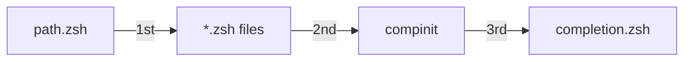

# 🧬 The Microdots Guide

**The Complete Guide to Creating Self-Contained Configuration Microservices**

---

## Table of Contents

1. [Core Philosophy](#core-philosophy)
2. [Anatomy of a Microdot](#anatomy-of-a-microdot)
3. [Creating Your First Microdot](#creating-your-first-microdot)
4. [Advanced Patterns](#advanced-patterns)
5. [Best Practices](#best-practices)
6. [Real-World Examples](#real-world-examples)
7. [Testing & Validation](#testing--validation)
8. [Troubleshooting](#troubleshooting)

---

## Core Philosophy

### The Microservice Mindset

Think of each microdot as an **independent microservice** that:

- **Self-discovers** - No registration required
- **Self-contains** - Everything needed in one directory
- **Self-defends** - Gracefully handles missing dependencies
- **Self-heals** - Can reinstall/reconfigure itself

### The Four Principles

1. **Zero Coupling** - Removing a microdot never breaks another
2. **Convention Over Configuration** - Naming patterns enable auto-discovery
3. **Defensive Programming** - Always check before configuring
4. **Progressive Enhancement** - Add features without breaking existing setup

---

## Anatomy of a Microdot

### Directory Structure

```
topic/                      # Microdot root directory
├── path.zsh               # PATH modifications (loaded 1st)
├── *.zsh                  # Configuration files (loaded 2nd)
├── completion.zsh         # Tab completions (loaded 4th, after compinit)
├── *.symlink             # Files to link to $HOME
├── install.sh            # Installation script
└── README.md             # Optional documentation
```

### File Types and Loading Order



#### 1. `path.zsh` - Environment Setup (Loaded First)

```bash
#!/usr/bin/env zsh
# PURPOSE: Ensure tool is in PATH before configuration
# LOADED: First, before any configuration

# Defensive: Check multiple possible locations
if [[ -x "/opt/homebrew/bin/tool" ]]; then
  export PATH="/opt/homebrew/bin:$PATH"
elif [[ -x "/usr/local/bin/tool" ]]; then
  export PATH="/usr/local/bin:$PATH"
fi

# Export environment variables
export TOOL_HOME="$HOME/.tool"
export TOOL_CONFIG="$HOME/.config/tool"
```

#### 2. `*.zsh` - Configuration Files (Loaded Second)

```bash
#!/usr/bin/env zsh
# PURPOSE: Configure tool, add aliases, functions
# LOADED: After PATH, before completions

# Defensive: Only configure if tool exists
if command -v tool >/dev/null 2>&1; then
  # Aliases
  alias t='tool'
  alias ts='tool status'
  
  # Functions
  tool_helper() {
    tool --advanced "$@"
  }
  
  # Initialize
  eval "$(tool init zsh)"
fi
```

#### 3. `completion.zsh` - Tab Completions (Loaded Last)

```bash
#!/usr/bin/env zsh
# PURPOSE: Add tab completion support
# LOADED: After compinit

# Defensive: Only if tool exists
if command -v tool >/dev/null 2>&1; then
  # Source completions if file exists
  [[ -f /usr/share/zsh/completions/_tool ]] && \
    source /usr/share/zsh/completions/_tool
    
  # Or generate completions dynamically
  eval "$(tool completions zsh)"
fi
```

#### 4. `*.symlink` - Configuration Files

```bash
# Files ending in .symlink are linked to $HOME
# Example: gitconfig.symlink → ~/.gitconfig

tool.symlink              → ~/.tool
config/settings.symlink   → ~/.config/settings
ssh.symlink/             → ~/.ssh/ (directories work too)
```

#### 5. `install.sh` - Installation Script

```bash
#!/usr/bin/env bash
# PURPOSE: Install and configure the tool
# PATTERN: Idempotent, defensive, informative

set -e

# Source UI library for consistent output
source "$DOTFILES_ROOT/core/lib/ui.sh" 2>/dev/null || {
  info() { echo "$@"; }
  success() { echo "✓ $@"; }
  error() { echo "✗ $@" >&2; }
}

info "Installing Tool..."

# Check if already installed
if command -v tool >/dev/null 2>&1; then
  success "Tool already installed"
  exit 0
fi

# Try installation methods in order
if command -v brew >/dev/null 2>&1; then
  brew install tool && success "Installed via Homebrew"
elif command -v apt-get >/dev/null 2>&1; then
  sudo apt-get install -y tool && success "Installed via apt"
else
  error "Could not install tool"
  exit 1
fi
```

---

## Creating Your First Microdot

### Step-by-Step Guide

#### Step 1: Create the Directory

```bash
# For public microdots
mkdir ~/.dotfiles/mytool

# For private microdots (with secrets/personal config)
mkdir ~/.dotlocal/mytool
```

#### Step 2: Add PATH Setup (if needed)

```bash
cat > ~/.dotfiles/mytool/path.zsh << 'EOF'
#!/usr/bin/env zsh
# Add mytool to PATH if it exists in a non-standard location

if [[ -d "$HOME/.mytool/bin" ]]; then
  export PATH="$HOME/.mytool/bin:$PATH"
fi

# Export any environment variables
export MYTOOL_HOME="$HOME/.mytool"
EOF
```

#### Step 3: Create Configuration

```bash
cat > ~/.dotfiles/mytool/config.zsh << 'EOF'
#!/usr/bin/env zsh
# Configure mytool - defensive programming is key

if command -v mytool >/dev/null 2>&1; then
  # Safe initialization
  eval "$(mytool init zsh 2>/dev/null)" || {
    echo "Warning: mytool init failed" >&2
  }
  
  # Aliases
  alias mt='mytool'
  alias mts='mytool status'
  alias mtl='mytool list'
  
  # Helpful functions
  mt_quick() {
    mytool --quick "$@"
  }
fi
EOF
```

#### Step 4: Add Installation Script

```bash
cat > ~/.dotfiles/mytool/install.sh << 'EOF'
#!/usr/bin/env bash
set -e

echo "Installing mytool..."

# Idempotent - check first
if command -v mytool >/dev/null 2>&1; then
  echo "✓ mytool already installed"
  exit 0
fi

# Install based on available package manager
if command -v brew >/dev/null 2>&1; then
  brew install mytool
else
  echo "Please install mytool manually"
  exit 1
fi

echo "✓ mytool installed successfully"
EOF

chmod +x ~/.dotfiles/mytool/install.sh
```

#### Step 5: Test Your Microdot

```bash
# Source your shell to load the new microdot
source ~/.zshrc

# Verify it loaded
type mt  # Should show your alias

# Test the install script
~/.dotfiles/mytool/install.sh
```

---

## Advanced Patterns

### Pattern 1: Conditional Features

```bash
# Enable advanced features only if dependencies exist
if command -v advanced_tool >/dev/null 2>&1; then
  source "${0:A:h}/advanced_features.zsh"
fi
```

### Pattern 2: Multi-Tool Microdots

```bash
# A microdot can manage related tools
node/
├── path.zsh         # Add node, npm, yarn to PATH
├── aliases.zsh      # Aliases for all tools
├── npm.zsh         # NPM-specific config
├── yarn.zsh        # Yarn-specific config
└── install.sh      # Install node, npm, yarn
```

### Pattern 3: Version Management

```bash
# Handle multiple versions gracefully
if [[ -x "/usr/local/opt/tool@2/bin/tool" ]]; then
  export PATH="/usr/local/opt/tool@2/bin:$PATH"
elif [[ -x "/usr/local/bin/tool" ]]; then
  export PATH="/usr/local/bin:$PATH"
fi
```

### Pattern 4: OS-Specific Configuration

```bash
# Platform-specific setup
case "$(uname -s)" in
  Darwin)
    source "${0:A:h}/macos.zsh"
    ;;
  Linux)
    source "${0:A:h}/linux.zsh"
    ;;
esac
```

### Pattern 5: Lazy Loading

```bash
# Defer expensive operations until needed
mytool() {
  unfunction mytool
  eval "$(mytool init zsh)"
  mytool "$@"
}
```

---

## Best Practices

### ✅ DO's

#### 1. Always Use Defensive Programming

```bash
# GOOD: Check before using
if command -v tool >/dev/null 2>&1; then
  eval "$(tool init)"
fi

# BAD: Assume tool exists
eval "$(tool init)"  # Will error if tool missing
```

#### 2. Make Install Scripts Idempotent

```bash
# GOOD: Can run multiple times
if [[ ! -f "$HOME/.tool/config" ]]; then
  cp config.template "$HOME/.tool/config"
fi

# BAD: Fails on second run
cp config.template "$HOME/.tool/config"  # Error if exists
```

#### 3. Provide Meaningful Output

```bash
# GOOD: Informative messages
info "Installing tool via Homebrew..."
brew install tool || error "Failed to install tool"
success "Tool installed successfully"

# BAD: Silent failure
brew install tool 2>/dev/null
```

#### 4. Handle Edge Cases

```bash
# GOOD: Multiple fallbacks
if command -v brew >/dev/null 2>&1; then
  brew install tool
elif command -v apt >/dev/null 2>&1; then
  sudo apt install tool
elif command -v pacman >/dev/null 2>&1; then
  sudo pacman -S tool
else
  error "No supported package manager found"
fi
```

#### 5. Use Consistent Naming

```bash
# GOOD: Predictable patterns
tool/
├── path.zsh          # Always path.zsh
├── aliases.zsh       # Descriptive names
├── functions.zsh     # Clear purpose
└── completion.zsh    # Always completion.zsh
```

### ❌ DON'Ts

#### 1. Don't Assume Paths

```bash
# BAD: Hardcoded paths
source /Users/myname/.dotfiles/tool/config.zsh

# GOOD: Dynamic paths
source "${0:A:h}/config.zsh"
```

#### 2. Don't Create Dependencies

```bash
# BAD: Depends on another microdot
source "$DOTFILES_ROOT/other_tool/lib.zsh"  # Coupling!

# GOOD: Self-contained
# Copy needed functions or check if available
```

#### 3. Don't Pollute Global Namespace

```bash
# BAD: Generic names
temp_var="something"
config() { ... }

# GOOD: Prefixed names
_tool_temp_var="something"
tool_config() { ... }
```

#### 4. Don't Fail Silently

```bash
# BAD: Swallow errors
tool init 2>/dev/null || true

# GOOD: Handle errors
tool init 2>/dev/null || {
  echo "Warning: tool initialization failed" >&2
}
```

---

## Real-World Examples

### Example 1: Docker Microdot

```bash
docker/
├── path.zsh
├── aliases.zsh
├── functions.zsh
├── completion.zsh
└── install.sh
```

**aliases.zsh:**
```bash
#!/usr/bin/env zsh

if command -v docker >/dev/null 2>&1; then
  # Container management
  alias dk='docker'
  alias dkp='docker ps'
  alias dkpa='docker ps -a'
  alias dki='docker images'
  
  # Cleanup
  alias dkclean='docker system prune -af'
  alias dkrm='docker rm $(docker ps -aq)'
  
  # Compose shortcuts
  alias dc='docker compose'
  alias dcup='docker compose up -d'
  alias dcdown='docker compose down'
  alias dclogs='docker compose logs -f'
fi
```

### Example 2: Python Development Microdot

```bash
python/
├── path.zsh         # Add pyenv, poetry to PATH
├── config.zsh       # Configure pyenv, virtualenv
├── aliases.zsh      # Python shortcuts
├── functions.zsh    # Helper functions
└── install.sh       # Install Python tools
```

**config.zsh:**
```bash
#!/usr/bin/env zsh

# Pyenv setup
if command -v pyenv >/dev/null 2>&1; then
  export PYENV_ROOT="$HOME/.pyenv"
  export PATH="$PYENV_ROOT/bin:$PATH"
  eval "$(pyenv init --path)"
  eval "$(pyenv init -)"
  
  # Auto-activate virtualenvs
  export PYENV_VIRTUALENV_DISABLE_PROMPT=1
  eval "$(pyenv virtualenv-init -)" 2>/dev/null
fi

# Poetry setup
if command -v poetry >/dev/null 2>&1; then
  export POETRY_HOME="$HOME/.poetry"
  export PATH="$POETRY_HOME/bin:$PATH"
fi
```

### Example 3: Git Enhancement Microdot

```bash
git-enhanced/
├── gitconfig.symlink     # Enhanced git config
├── gitignore.symlink     # Global gitignore
├── aliases.zsh           # Git aliases
├── functions.zsh         # Git functions
└── install.sh           # Install git extras
```

**functions.zsh:**
```bash
#!/usr/bin/env zsh

# Only define if git exists
if command -v git >/dev/null 2>&1; then
  
  # Interactive branch selection
  git_branch_select() {
    local branch=$(git branch -a | fzf | tr -d '[:space:]')
    [[ -n "$branch" ]] && git checkout "$branch"
  }
  
  # Quick commit with message
  git_quick_commit() {
    git add -A && git commit -m "$*"
  }
  
  # Show git log graph
  git_graph() {
    git log --graph --pretty=format:'%C(yellow)%h%C(reset) %C(blue)%d%C(reset) %s %C(green)(%cr)%C(reset) %C(dim)%an%C(reset)' --abbrev-commit --all
  }
  
  # Aliases using functions
  alias gbs='git_branch_select'
  alias gqc='git_quick_commit'
  alias gg='git_graph'
fi
```

### Example 4: AWS CLI Microdot

```bash
aws/
├── path.zsh              # AWS CLI paths
├── config.zsh            # AWS configuration
├── aliases.zsh           # AWS shortcuts
├── functions.zsh         # AWS helpers
├── credentials.symlink   # → ~/.aws/credentials (in .dotlocal!)
└── install.sh           # Install AWS CLI
```

**functions.zsh:**
```bash
#!/usr/bin/env zsh

if command -v aws >/dev/null 2>&1; then
  
  # Switch AWS profile
  aws_profile() {
    export AWS_PROFILE="$1"
    echo "Switched to AWS profile: $AWS_PROFILE"
  }
  
  # List all instances
  aws_instances() {
    aws ec2 describe-instances \
      --query 'Reservations[*].Instances[*].[InstanceId,State.Name,Tags[?Key==`Name`]|[0].Value]' \
      --output table
  }
  
  # Get SSM parameter
  aws_param() {
    aws ssm get-parameter --name "$1" --with-decryption \
      --query 'Parameter.Value' --output text
  }
  
  # Assume role
  aws_assume() {
    local role_arn="$1"
    local session_name="${2:-session-$(date +%s)}"
    
    local creds=$(aws sts assume-role \
      --role-arn "$role_arn" \
      --role-session-name "$session_name" \
      --query 'Credentials.[AccessKeyId,SecretAccessKey,SessionToken]' \
      --output text)
    
    export AWS_ACCESS_KEY_ID=$(echo $creds | cut -d' ' -f1)
    export AWS_SECRET_ACCESS_KEY=$(echo $creds | cut -d' ' -f2)
    export AWS_SESSION_TOKEN=$(echo $creds | cut -d' ' -f3)
  }
fi
```

---

## Testing & Validation

### Testing Your Microdot

#### 1. Syntax Check

```bash
# Check all zsh files for syntax errors
for file in ~/.dotfiles/mytool/*.zsh; do
  zsh -n "$file" || echo "Syntax error in $file"
done
```

#### 2. Isolation Test

```bash
# Test that microdot works in isolation
zsh -c "source ~/.dotfiles/mytool/config.zsh && type myalias"
```

#### 3. Dependency Test

```bash
# Temporarily remove dependency and ensure no errors
PATH="/tmp:$PATH" zsh -c "source ~/.dotfiles/mytool/config.zsh"
```

#### 4. Installation Test

```bash
# Test installation in clean environment
docker run -it ubuntu:latest bash -c "
  apt-get update && apt-get install -y zsh git
  git clone https://github.com/user/dotfiles ~/.dotfiles
  ~/.dotfiles/mytool/install.sh
"
```

### Validation Checklist

- [ ] Microdot loads without errors when tool is missing
- [ ] Microdot functions correctly when tool is present
- [ ] Install script is idempotent (can run multiple times)
- [ ] No hardcoded paths (especially usernames)
- [ ] No dependencies on other microdots
- [ ] PATH additions are guarded
- [ ] Completions load after compinit
- [ ] Symlinks are created correctly

---

## Troubleshooting

### Common Issues and Solutions

#### Issue: Microdot Not Loading

```bash
# Debug: Check if files are being sourced
echo "Loading mytool" > ~/.dotfiles/mytool/debug.zsh

# Reload shell and look for message
source ~/.zshrc
```

#### Issue: Command Not Found

```bash
# Debug: Check PATH
echo $PATH | tr ':' '\n' | grep mytool

# Fix: Ensure path.zsh is setting PATH correctly
# Remember: path.zsh loads FIRST
```

#### Issue: Completions Not Working

```bash
# Debug: Check load order
zsh -x -c 'source ~/.zshrc 2>&1' | grep -E "(compinit|completion.zsh)"

# Fix: Ensure completion.zsh loads AFTER compinit
```

#### Issue: Conflicts with System Tools

```bash
# Use functions to wrap and extend
mytool() {
  # Custom preprocessing
  command mytool "$@"
  # Custom postprocessing
}
```

#### Issue: Slow Shell Startup

```bash
# Profile your shell startup
zsh -x -c 'source ~/.zshrc' 2>&1 | ts '%.s' > startup.log

# Implement lazy loading for expensive operations
alias heavy_tool='source ~/.dotfiles/heavy_tool/lazy.zsh && heavy_tool'
```

---

## Advanced Tips

### 1. Modular Subtopics

For complex tools, use subtopics:

```bash
kubernetes/
├── kubectl/
│   ├── aliases.zsh
│   └── functions.zsh
├── helm/
│   ├── path.zsh
│   └── config.zsh
├── k9s/
│   └── config.zsh
└── install.sh  # Installs all Kubernetes tools
```

### 2. Shared Libraries

Create reusable functions without coupling:

```bash
# In microdot's lib.zsh
_mytool_shared_function() {
  # Prefixed to avoid conflicts
}

# Source only if file exists
[[ -f "${0:A:h}/lib.zsh" ]] && source "${0:A:h}/lib.zsh"
```

### 3. Configuration Templates

```bash
# install.sh can create configs from templates
if [[ ! -f "$HOME/.config/tool/config.yml" ]]; then
  mkdir -p "$HOME/.config/tool"
  cat > "$HOME/.config/tool/config.yml" << 'EOF'
# Tool Configuration
option1: value1
option2: value2
EOF
fi
```

### 4. Update Mechanisms

```bash
# Add update function to your microdot
mytool_update() {
  echo "Updating mytool..."
  brew upgrade mytool 2>/dev/null || {
    curl -L https://mytool.com/install.sh | bash
  }
}
```

### 5. Environment Detection

```bash
# Adapt to different environments
if [[ -n "$SSH_CONNECTION" ]]; then
  # Remote session configurations
  export MYTOOL_MODE="remote"
elif [[ "$TERM_PROGRAM" == "vscode" ]]; then
  # VSCode terminal configurations
  export MYTOOL_MODE="vscode"
fi
```

---

## Conclusion

Microdots transform your dotfiles from a monolithic mess into a clean, maintainable, and scalable system. By following these patterns and principles, you create a configuration system that:

- **Grows** with your needs without becoming unwieldy
- **Shares** easily with others without forcing your preferences
- **Adapts** to different environments automatically
- **Recovers** from failures gracefully
- **Maintains** itself with minimal effort

Remember: **Each microdot is a promise** — a promise that it will work independently, fail gracefully, and never break your system.

---

*Happy microdotting! 🧬*